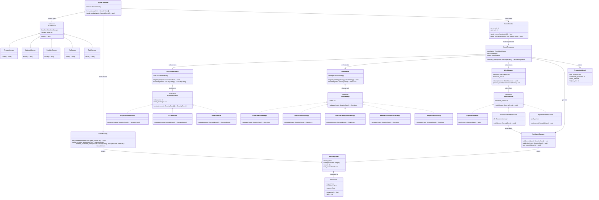

```mermaid
classDiagram
    class AgentController {
      -sensors: BaseSensor[]
      +run_scan_cycle(): SecurityEvent[]
      +send_results(events: SecurityEvent[]): bool
    }

    class EventSender {
      -server_url: str
      -agent_id: str
      +send_events(events: dict[]): bool
      +send_heartbeat(sensors: str[], uptime: float): bool
    }

    class EventFactory {
      +set_context(hostname: str, agent_version: str): void
      +create_process_event(data: dict): SecurityEvent
      +create_correlated_event(source: SecurityEvent[], description: str, mitre: str): SecurityEvent
    }

    class BaseSensor {
      <<abstract>>
      -baseline: BaselineManager
      +sensor_name: str
      +scan(): dict[]
    }

    class ProcessSensor {
      +scan(): dict[]
    }

    class NetworkSensor {
      +scan(): dict[]
    }

    class RegistrySensor {
      +scan(): dict[]
    }

    class FileSensor {
      +scan(): dict[]
    }

    class TaskSensor {
      +scan(): dict[]
    }

    class SecurityEvent {
      +event_id: str
      +category: EventCategory
      +details: dict
      +risk_score: RiskScore
    }

    class RiskScore {
      +impact: float
      +confidence: float
      +urgency: float
      +composite(): float
      +tier(): str
    }

    class EventProcessor {
      -correlation: CorrelationEngine
      -risk: RiskEngine
      -alerts: AlertManager
      +process_batch(events: SecurityEvent[]): ProcessingResult
    }

    class ProcessingResult {
      +total_received: int
      +correlated_generated: int
      +alerts_fired: int
      +highest_tier: str
    }

    class CorrelationEngine {
      -rules: CorrelationRule[]
      +register_rule(rule: CorrelationRule): void
      +correlate(events: SecurityEvent[]): SecurityEvent[]
    }

    class CorrelationRule {
      <<interface>>
      +evaluate(events: SecurityEvent[]): SecurityEvent[]
      +rule_name: str
      +mitre_technique: str
    }

    class SuspiciousParentRule {
      +evaluate(events: SecurityEvent[]): SecurityEvent[]
    }

    class LOLBASRule {
      +evaluate(events: SecurityEvent[]): SecurityEvent[]
    }

    class FirstSeenRule {
      +evaluate(events: SecurityEvent[]): SecurityEvent[]
    }

    class RiskEngine {
      -strategies: RiskStrategy[]
      +register_strategy(strategy: RiskStrategy): void
      +evaluate(event: SecurityEvent): RiskScore
    }

    class RiskStrategy {
      <<interface>>
      +calculate(event: SecurityEvent): RiskScore
      +name: str
    }

    class BaselineRiskStrategy {
      +calculate(event: SecurityEvent): RiskScore
    }

    class LOLBASRiskStrategy {
      +calculate(event: SecurityEvent): RiskScore
    }

    class ProcessLineageRiskStrategy {
      +calculate(event: SecurityEvent): RiskScore
    }

    class NetworkAnomalyRiskStrategy {
      +calculate(event: SecurityEvent): RiskScore
    }

    class TemporalRiskStrategy {
      +calculate(event: SecurityEvent): RiskScore
    }

    class AlertManager {
      -observers: AlertObserver[]
      -threshold_tier: str
      +attach(observer: AlertObserver): void
      +process_event(event: SecurityEvent): int
    }

    class AlertObserver {
      <<interface>>
      +notify(event: SecurityEvent): void
      +observer_name: str
    }

    class LogAlertObserver {
      +notify(event: SecurityEvent): void
    }

    class DashboardAlertObserver {
      -db: DatabaseManager
      +notify(event: SecurityEvent): void
    }

    class UptimeKumaObserver {
      -push_url: str
      +notify(event: SecurityEvent): void
    }

    class DatabaseManager {
      +add_event(event: SecurityEvent): void
      +add_alert(event: SecurityEvent): void
      +get_events(days: int): dict[]
    }

    BaseSensor <|-- ProcessSensor
    BaseSensor <|-- NetworkSensor
    BaseSensor <|-- RegistrySensor
    BaseSensor <|-- FileSensor
    BaseSensor <|-- TaskSensor

    CorrelationRule <|.. SuspiciousParentRule
    CorrelationRule <|.. LOLBASRule
    CorrelationRule <|.. FirstSeenRule

    RiskStrategy <|.. BaselineRiskStrategy
    RiskStrategy <|.. LOLBASRiskStrategy
    RiskStrategy <|.. ProcessLineageRiskStrategy
    RiskStrategy <|.. NetworkAnomalyRiskStrategy
    RiskStrategy <|.. TemporalRiskStrategy

    AlertObserver <|.. LogAlertObserver
    AlertObserver <|.. DashboardAlertObserver
    AlertObserver <|.. UptimeKumaObserver

    AgentController o-- BaseSensor : collects from
    AgentController --> EventFactory : builds events
    AgentController --> EventSender : sends batch
    EventFactory --> SecurityEvent : creates
    EventSender ..> EventProcessor : POST /api/events

    EventProcessor --> CorrelationEngine : orchestrates
    EventProcessor --> RiskEngine : orchestrates
    EventProcessor --> AlertManager : orchestrates
    EventProcessor --> DatabaseManager : persists
    EventProcessor --> ProcessingResult : returns

    CorrelationEngine o-- CorrelationRule : strategy set
    RiskEngine o-- RiskStrategy : strategy set
    AlertManager o-- AlertObserver : subscribers

    SecurityEvent *-- RiskScore : composed of
    DatabaseManager --> SecurityEvent : stores
    DashboardAlertObserver --> DatabaseManager : writes alerts

```