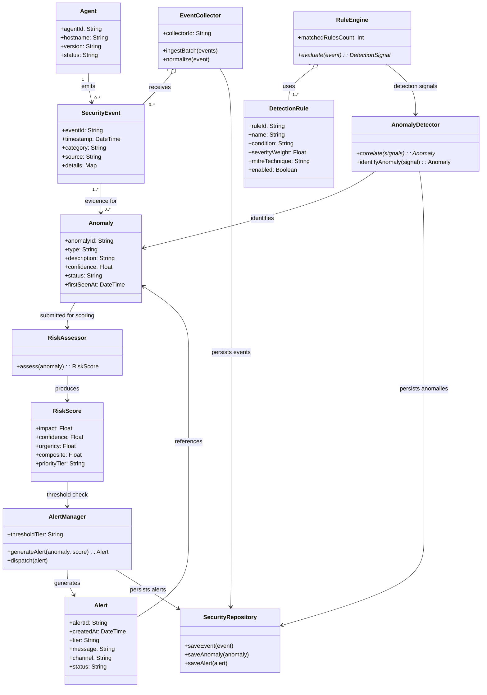

```mermaid
classDiagram
    class Agent {
      +agentId: String
      +hostname: String
      +version: String
      +status: String
    }

    class SecurityEvent {
      +eventId: String
      +timestamp: DateTime
      +category: String
      +source: String
      +details: Map
    }

    class EventCollector {
      +collectorId: String
      +ingestBatch(events)
      +normalize(event)
    }

    class DetectionRule {
      +ruleId: String
      +name: String
      +condition: String
      +severityWeight: Float
      +mitreTechnique: String
      +enabled: Boolean
    }

    class RuleEngine {
      +evaluate(event): DetectionSignal*
      +matchedRulesCount: Int
    }

    class AnomalyDetector {
      +correlate(signals): Anomaly*
      +identifyAnomaly(signal): Anomaly
    }

    class Anomaly {
      +anomalyId: String
      +type: String
      +description: String
      +confidence: Float
      +status: String
      +firstSeenAt: DateTime
    }

    class RiskAssessor {
      +assess(anomaly): RiskScore
    }

    class RiskScore {
      +impact: Float
      +confidence: Float
      +urgency: Float
      +composite: Float
      +priorityTier: String
    }

    class AlertManager {
      +thresholdTier: String
      +generateAlert(anomaly, score): Alert
      +dispatch(alert)
    }

    class Alert {
      +alertId: String
      +createdAt: DateTime
      +tier: String
      +message: String
      +channel: String
      +status: String
    }

    class SecurityRepository {
      +saveEvent(event)
      +saveAnomaly(anomaly)
      +saveAlert(alert)
    }

    Agent "1" --> "0..*" SecurityEvent : emits
    EventCollector "1" o-- "0..*" SecurityEvent : receives
    RuleEngine "1" o-- "1..*" DetectionRule : uses
    RuleEngine --> AnomalyDetector : detection signals
    SecurityEvent "1..*" --> "0..*" Anomaly : evidence for
    AnomalyDetector --> Anomaly : identifies
    Anomaly --> RiskAssessor : submitted for scoring
    RiskAssessor --> RiskScore : produces
    RiskScore --> AlertManager : threshold check
    AlertManager --> Alert : generates
    Alert --> Anomaly : references
    EventCollector --> SecurityRepository : persists events
    AnomalyDetector --> SecurityRepository : persists anomalies
    AlertManager --> SecurityRepository : persists alerts
```