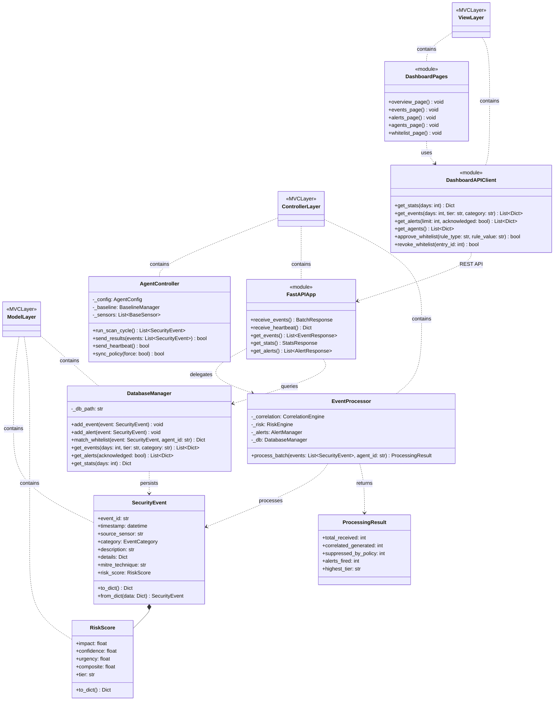
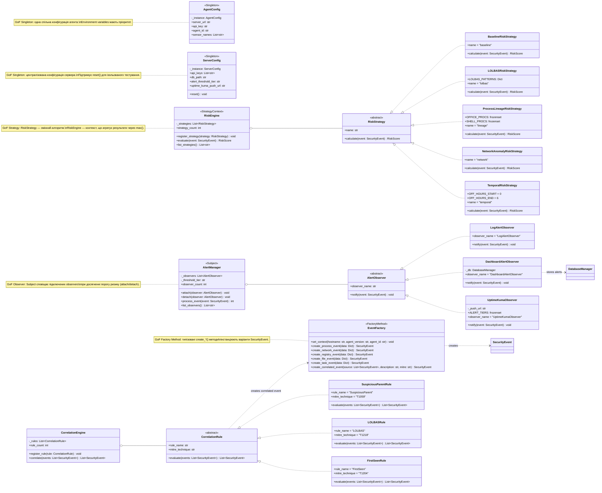

# Рис. 2.1 — Загальна MVC-архітектура системи HIDS

```mermaid
classDiagram
direction TB

class ViewLayer {
    <<MVCLayer>>
}

class ControllerLayer {
    <<MVCLayer>>
}

class ModelLayer {
    <<MVCLayer>>
}

class DashboardPages {
    <<module>>
    +overview_page() void
    +events_page() void
    +alerts_page() void
    +agents_page() void
    +whitelist_page() void
}

class DashboardAPIClient {
    <<module>>
    +get_stats(days: int) Dict
    +get_events(days: int, tier: str, category: str) List~Dict~
    +get_alerts(limit: int, acknowledged: bool) List~Dict~
    +get_agents() List~Dict~
    +approve_whitelist(rule_type: str, rule_value: str) bool
    +revoke_whitelist(entry_id: int) bool
}

class AgentController {
    -_config: AgentConfig
    -_baseline: BaselineManager
    -_sensors: List~BaseSensor~
    +run_scan_cycle() List~SecurityEvent~
    +send_results(events: List~SecurityEvent~) bool
    +send_heartbeat() bool
    +sync_policy(force: bool) bool
}

class FastAPIApp {
    <<module>>
    +receive_events() BatchResponse
    +receive_heartbeat() Dict
    +get_events() List~EventResponse~
    +get_stats() StatsResponse
    +get_alerts() List~AlertResponse~
}

class EventProcessor {
    -_correlation: CorrelationEngine
    -_risk: RiskEngine
    -_alerts: AlertManager
    -_db: DatabaseManager
    +process_batch(events: List~SecurityEvent~, agent_id: str) ProcessingResult
}

class SecurityEvent {
    +event_id: str
    +timestamp: datetime
    +source_sensor: str
    +category: EventCategory
    +description: str
    +details: Dict
    +mitre_technique: str
    +risk_score: RiskScore
    +to_dict() Dict
    +from_dict(data: Dict) SecurityEvent
}

class RiskScore {
    +impact: float
    +confidence: float
    +urgency: float
    +composite: float
    +tier: str
    +to_dict() Dict
}

class DatabaseManager {
    -_db_path: str
    +add_event(event: SecurityEvent) void
    +add_alert(event: SecurityEvent) void
    +match_whitelist(event: SecurityEvent, agent_id: str) Dict
    +get_events(days: int, tier: str, category: str) List~Dict~
    +get_alerts(acknowledged: bool) List~Dict~
    +get_stats(days: int) Dict
}

class ProcessingResult {
    +total_received: int
    +correlated_generated: int
    +suppressed_by_policy: int
    +alerts_fired: int
    +highest_tier: str
}

ViewLayer .. DashboardPages : contains
ViewLayer .. DashboardAPIClient : contains
ControllerLayer .. AgentController : contains
ControllerLayer .. FastAPIApp : contains
ControllerLayer .. EventProcessor : contains
ModelLayer .. SecurityEvent : contains
ModelLayer .. RiskScore : contains
ModelLayer .. DatabaseManager : contains

DashboardPages ..> DashboardAPIClient : uses
DashboardAPIClient ..> FastAPIApp : REST API

FastAPIApp ..> EventProcessor : delegates
FastAPIApp ..> DatabaseManager : queries

EventProcessor ..> SecurityEvent : processes
EventProcessor ..> ProcessingResult : returns

SecurityEvent *-- RiskScore
DatabaseManager ..> SecurityEvent : persists
```

---

# Рис. 2.2 — Діаграма класів патернів GoF

```mermaid
classDiagram
direction LR

%% ── Factory Method ─────────────────────────────────────────────
class EventFactory {
    <<FactoryMethod>>
    +set_context(hostname: str, agent_version: str, agent_id: str) void
    +create_process_event(data: Dict) SecurityEvent
    +create_network_event(data: Dict) SecurityEvent
    +create_registry_event(data: Dict) SecurityEvent
    +create_file_event(data: Dict) SecurityEvent
    +create_task_event(data: Dict) SecurityEvent
    +create_correlated_event(source: List~SecurityEvent~, description: str, mitre: str) SecurityEvent
}

%% ── Singleton ───────────────────────────────────────────────────
class AgentConfig {
    <<Singleton>>
    -_instance: AgentConfig
    +server_url: str
    +api_key: str
    +agent_id: str
    +sensor_names: List~str~
}

class ServerConfig {
    <<Singleton>>
    -_instance: ServerConfig
    +api_keys: List~str~
    +db_path: str
    +alert_threshold_tier: str
    +uptime_kuma_push_url: str
    +reset() void
}

%% ── Strategy Pattern ────────────────────────────────────────────
class RiskEngine {
    <<StrategyContext>>
    -_strategies: List~RiskStrategy~
    +register_strategy(strategy: RiskStrategy) void
    +evaluate(event: SecurityEvent) RiskScore
    +strategy_count: int
    +list_strategies() List~str~
}

class RiskStrategy {
    <<abstract>>
    +calculate(event: SecurityEvent) RiskScore
    +name: str
}

class BaselineRiskStrategy {
    +name = "baseline"
    +calculate(event: SecurityEvent) RiskScore
}
class LOLBASRiskStrategy {
    +LOLBAS_PATTERNS: Dict
    +name = "lolbas"
    +calculate(event: SecurityEvent) RiskScore
}
class ProcessLineageRiskStrategy {
    +OFFICE_PROCS: frozenset
    +SHELL_PROCS: frozenset
    +name = "lineage"
    +calculate(event: SecurityEvent) RiskScore
}
class NetworkAnomalyRiskStrategy {
    +name = "network"
    +calculate(event: SecurityEvent) RiskScore
}
class TemporalRiskStrategy {
    +OFF_HOURS_START = 0
    +OFF_HOURS_END = 6
    +name = "temporal"
    +calculate(event: SecurityEvent) RiskScore
}

%% ── Observer Pattern ────────────────────────────────────────────
class AlertManager {
    <<Subject>>
    -_observers: List~AlertObserver~
    -_threshold_tier: str
    +attach(observer: AlertObserver) void
    +detach(observer: AlertObserver) void
    +process_event(event: SecurityEvent) int
    +observer_count: int
    +list_observers() List~str~
}

class AlertObserver {
    <<abstract>>
    +notify(event: SecurityEvent) void
    +observer_name: str
}

class LogAlertObserver {
    +observer_name = "LogAlertObserver"
    +notify(event: SecurityEvent) void
}
class DashboardAlertObserver {
    -_db: DatabaseManager
    +observer_name = "DashboardAlertObserver"
    +notify(event: SecurityEvent) void
}
class UptimeKumaObserver {
    -_push_url: str
    +ALERT_TIERS: frozenset
    +observer_name = "UptimeKumaObserver"
    +notify(event: SecurityEvent) void
}

%% ── Correlation (Strategy-like extensible rules) ────────────────
class CorrelationEngine {
    -_rules: List~CorrelationRule~
    +register_rule(rule: CorrelationRule) void
    +correlate(events: List~SecurityEvent~) List~SecurityEvent~
    +rule_count: int
}

class CorrelationRule {
    <<abstract>>
    +evaluate(events: List~SecurityEvent~) List~SecurityEvent~
    +rule_name: str
    +mitre_technique: str
}

class SuspiciousParentRule {
    +rule_name = "SuspiciousParent"
    +mitre_technique = "T1059"
    +evaluate(events: List~SecurityEvent~) List~SecurityEvent~
}
class LOLBASRule {
    +rule_name = "LOLBAS"
    +mitre_technique = "T1218"
    +evaluate(events: List~SecurityEvent~) List~SecurityEvent~
}
class FirstSeenRule {
    +rule_name = "FirstSeen"
    +mitre_technique = "T1204"
    +evaluate(events: List~SecurityEvent~) List~SecurityEvent~
}

%% ── Relationships ───────────────────────────────────────────────
RiskStrategy <|.. BaselineRiskStrategy
RiskStrategy <|.. LOLBASRiskStrategy
RiskStrategy <|.. ProcessLineageRiskStrategy
RiskStrategy <|.. NetworkAnomalyRiskStrategy
RiskStrategy <|.. TemporalRiskStrategy

RiskEngine o-- RiskStrategy

AlertObserver <|.. LogAlertObserver
AlertObserver <|.. DashboardAlertObserver
AlertObserver <|.. UptimeKumaObserver

AlertManager o-- AlertObserver

DashboardAlertObserver ..> DatabaseManager : stores alerts

CorrelationRule <|.. SuspiciousParentRule
CorrelationRule <|.. LOLBASRule
CorrelationRule <|.. FirstSeenRule

CorrelationEngine o-- CorrelationRule
CorrelationRule ..> EventFactory : creates correlated event

EventFactory ..> SecurityEvent : creates

note for AgentConfig "GoF Singleton: одна спільна конфігурація агента.\nEnvironment variables мають пріоритет."
note for ServerConfig "GoF Singleton: централізована конфігурація сервера.\nПідтримує reset() для ізольованого тестування."
note for EventFactory "GoF Factory Method: типізовані create_*() методи\nінстанціюють варіанти SecurityEvent."
note for RiskEngine "GoF Strategy: RiskStrategy — змінний алгоритм.\nRiskEngine — контекст, що агрегує результати через max()."
note for AlertManager "GoF Observer: Subject сповіщає підключених observers\nпри досягненні порогу ризику (attach/detach)."
```
