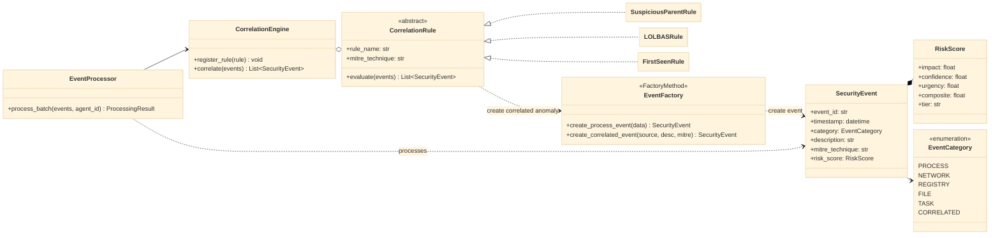
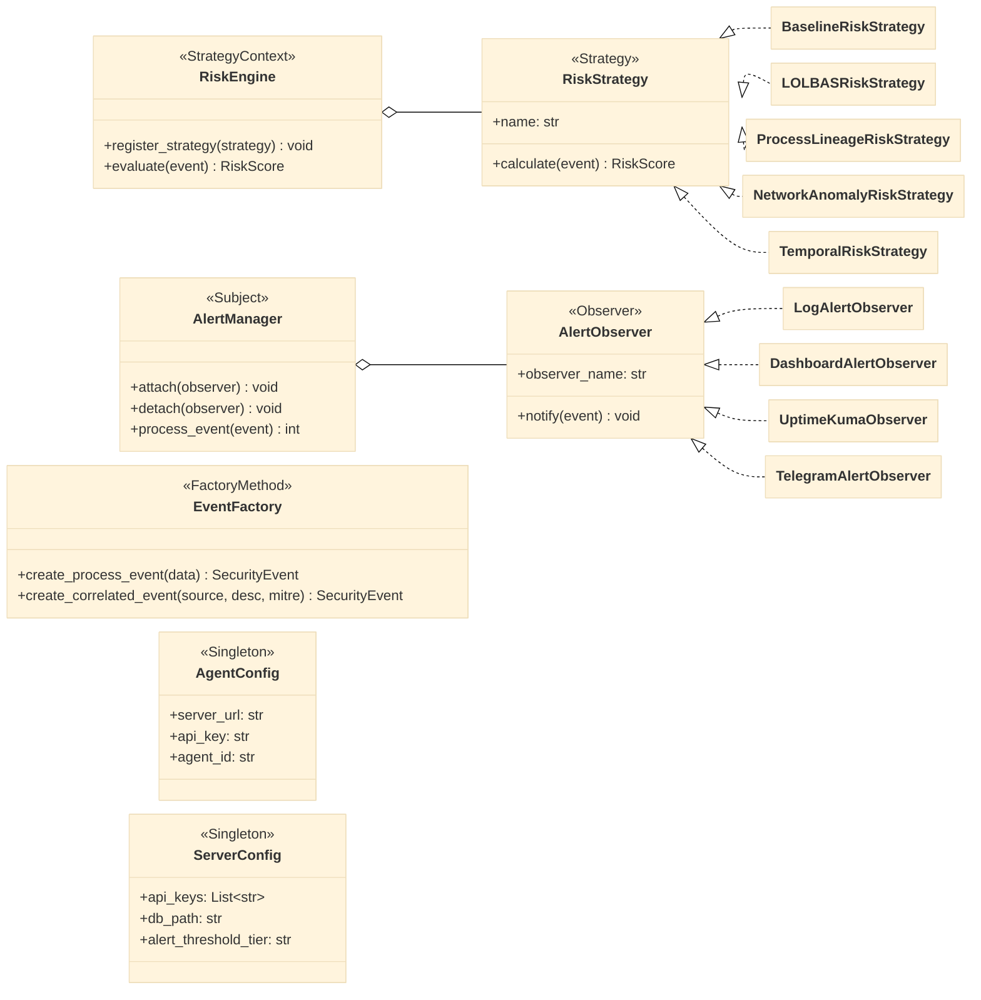
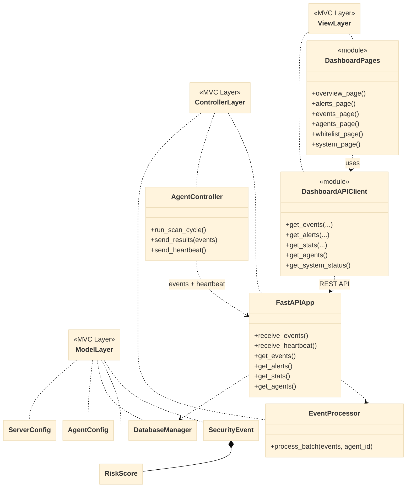
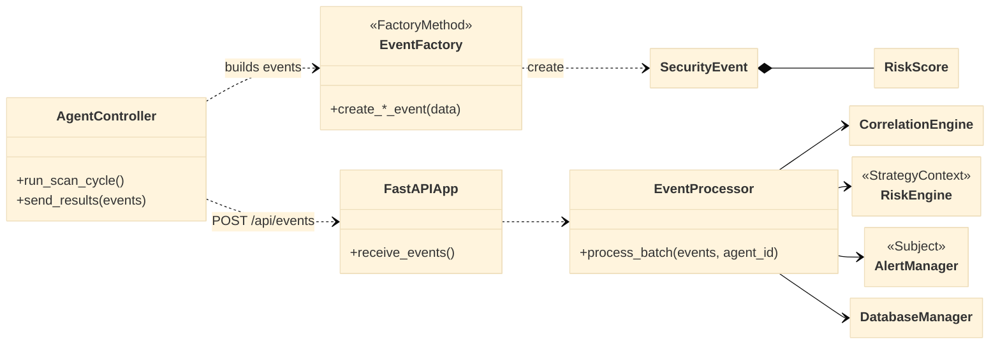

# UML для курсової (розбиття на 4 компактні діаграми)

## 1) Предметна область HIDS: події, аномалії, правила, пріоритети

## 2) Патерни GoF у проєкті

## 3) Архітектурний поділ за MVC

## 4) Міні-діаграма пайплайна обробки

