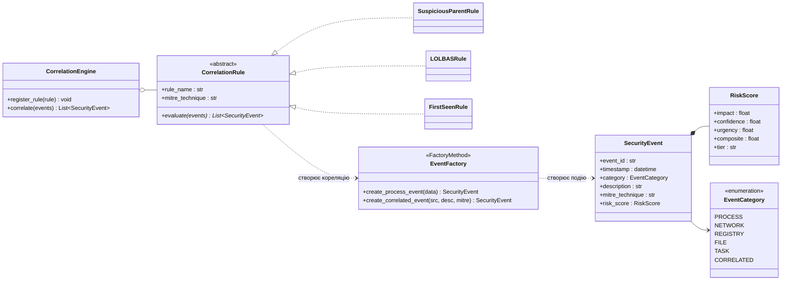
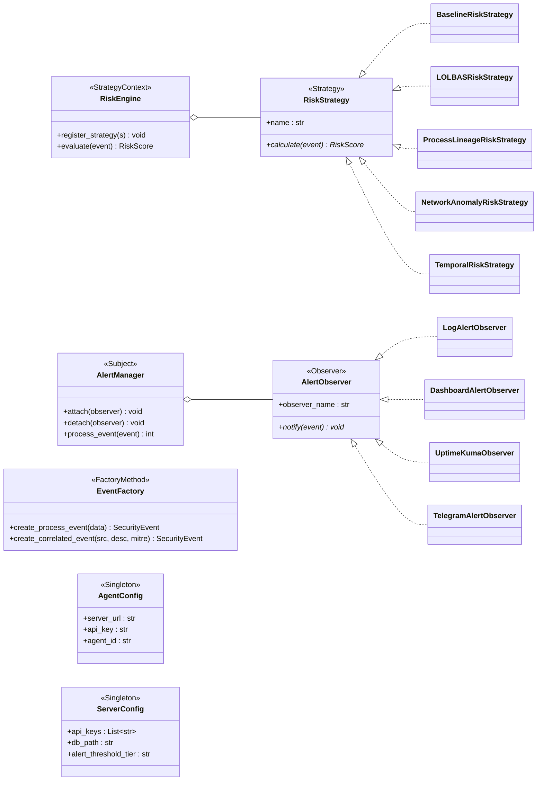
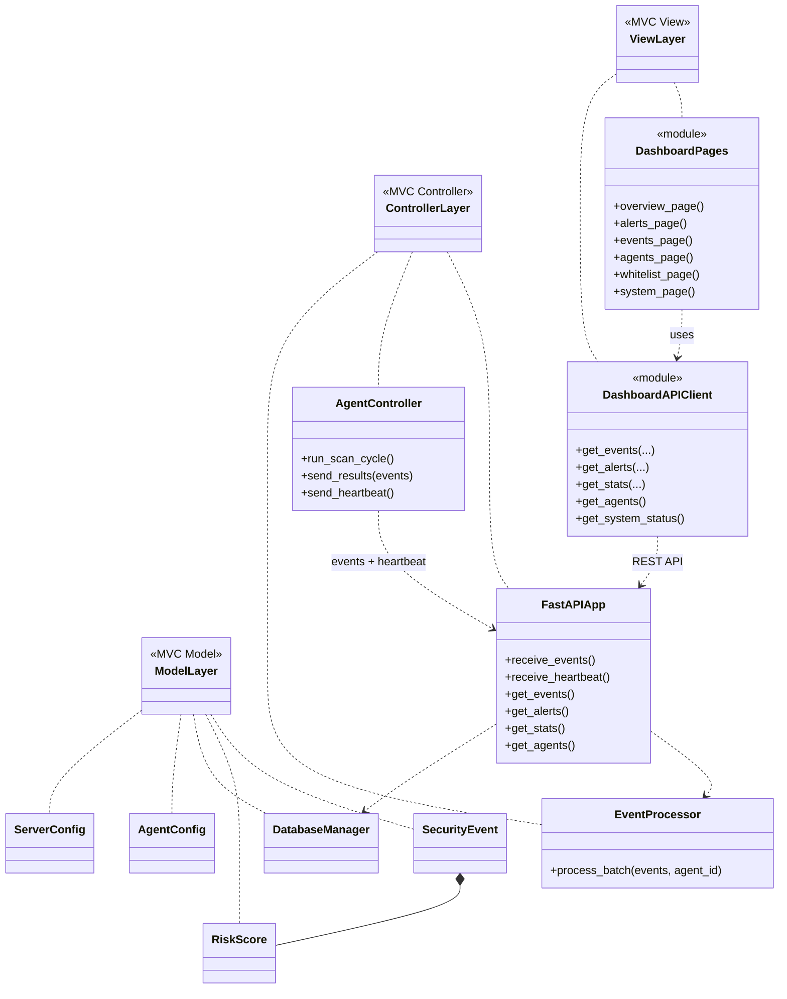
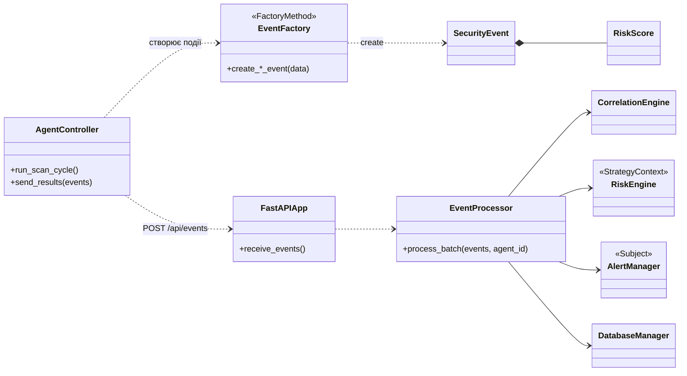

# UML-діаграми для курсової роботи (4 компактні діаграми)

## 1. Діаграма класів предметної області

> Події безпеки, оцінка ризику, кореляційні правила, пріоритети.

---

## 2. Діаграма патернів GoF

> Strategy — оцінка ризику; Observer — сповіщення; Factory Method — створення подій; Singleton — конфігурація.

---

## 3. Архітектурний поділ за MVC

> View — Dashboard (Streamlit); Controller — FastAPI, AgentController, EventProcessor; Model — доменні дані та база.

---

## 4. Пайплайн обробки подій

> Шлях події: Agent → Factory → Server → CorrelationEngine → RiskEngine → AlertManager → Database.

