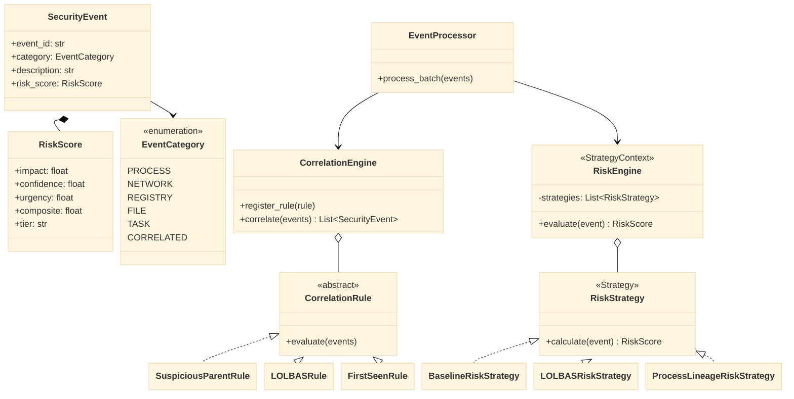
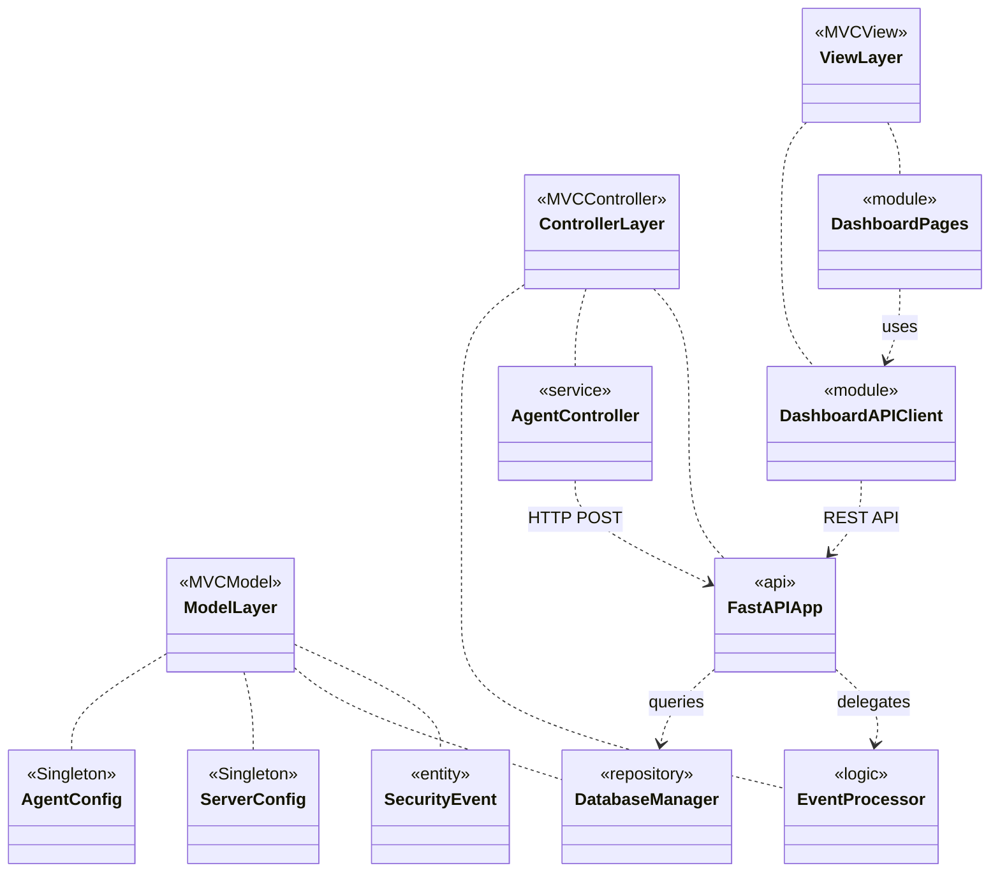

# Рис. 2.1 — UML-діаграма класів предметної області HIDS

```mermaid
%%{init: {"theme":"base","flowchart":{"nodeSpacing":14,"rankSpacing":14},"class":{"hideEmptyMembersBox":true}}}%%
classDiagram
direction TB

class SecurityEvent {
    +event_id: str
    +category: EventCategory
    +description: str
    +risk_score: RiskScore
}

class RiskScore {
    +impact: float
    +confidence: float
    +urgency: float
    +composite: float
    +tier: str
}

class EventCategory {
    <<enumeration>>
    PROCESS
    NETWORK
    REGISTRY
    FILE
    TASK
    CORRELATED
}

class CorrelationEngine {
    +register_rule(rule)
    +correlate(events) List~SecurityEvent~
}

class CorrelationRule {
    <<abstract>>
    +evaluate(events)
}
class SuspiciousParentRule
class LOLBASRule
class FirstSeenRule

class RiskEngine {
    <<StrategyContext>>
    -strategies: List~RiskStrategy~
    +evaluate(event) RiskScore
}

class RiskStrategy {
    <<Strategy>>
    <<abstract>>
    +calculate(event) RiskScore
}
class BaselineRiskStrategy
class LOLBASRiskStrategy
class ProcessLineageRiskStrategy

class EventProcessor {
    +process_batch(events)
}

SecurityEvent *-- RiskScore
SecurityEvent --> EventCategory

CorrelationRule <|.. SuspiciousParentRule
CorrelationRule <|.. LOLBASRule
CorrelationRule <|.. FirstSeenRule
CorrelationEngine o-- CorrelationRule

RiskStrategy <|.. BaselineRiskStrategy
RiskStrategy <|.. LOLBASRiskStrategy
RiskStrategy <|.. ProcessLineageRiskStrategy
RiskEngine o-- RiskStrategy

EventProcessor --> CorrelationEngine
EventProcessor --> RiskEngine
```

---

# Рис. 2.2 — Архітектурний поділ системи за MVC

```mermaid
classDiagram
direction TB

class ViewLayer { <<MVCView>> }
class ControllerLayer { <<MVCController>> }
class ModelLayer { <<MVCModel>> }

class DashboardPages { <<module>> }
class DashboardAPIClient { <<module>> }
class FastAPIApp { <<api>> }
class AgentController { <<service>> }
class EventProcessor { <<logic>> }

class SecurityEvent { <<entity>> }
class DatabaseManager { <<repository>> }
class ServerConfig { <<Singleton>> }
class AgentConfig { <<Singleton>> }

ViewLayer .. DashboardPages
ViewLayer .. DashboardAPIClient

ControllerLayer .. FastAPIApp
ControllerLayer .. AgentController
ControllerLayer .. EventProcessor

ModelLayer .. SecurityEvent
ModelLayer .. DatabaseManager
ModelLayer .. ServerConfig
ModelLayer .. AgentConfig

DashboardPages ..> DashboardAPIClient : uses
DashboardAPIClient ..> FastAPIApp : REST API
AgentController ..> FastAPIApp : HTTP POST
FastAPIApp ..> EventProcessor : delegates
FastAPIApp ..> DatabaseManager : queries
```
