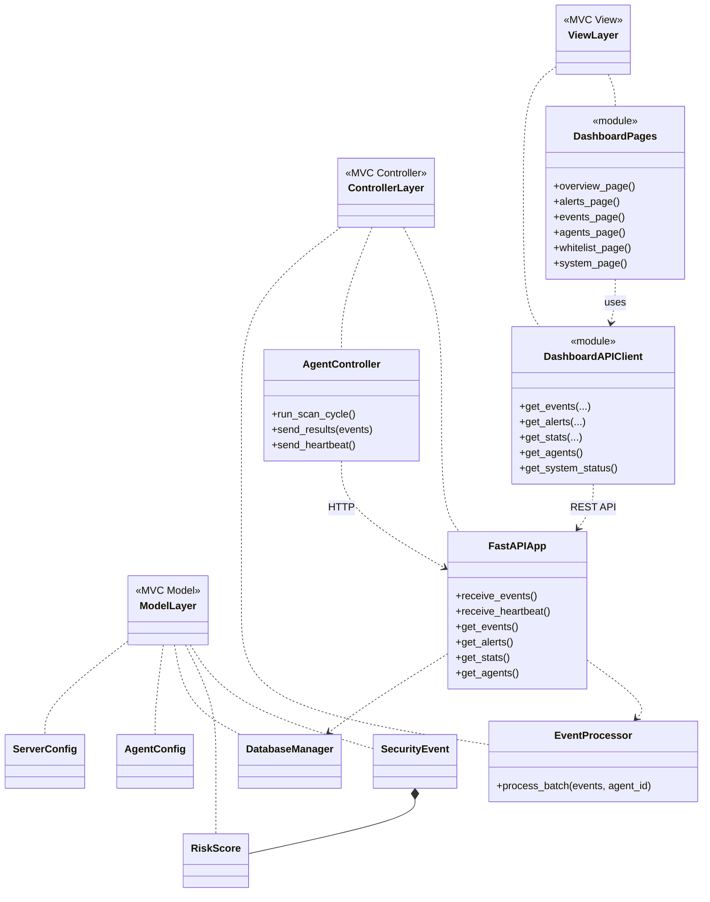
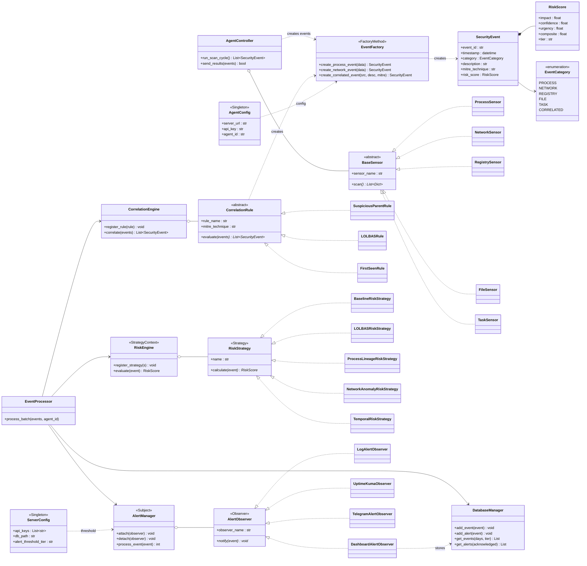

# UML-діаграми класів для курсової роботи

---

*Рис. 2.1. Архітектурна декомпозиція системи за патерном MVC.*
*Джерело: авторські напрацювання.*

---

*Рис. 2.2. UML-діаграма класів підсистеми аналізу та патернів GoF.*
*Джерело: авторські напрацювання.*
