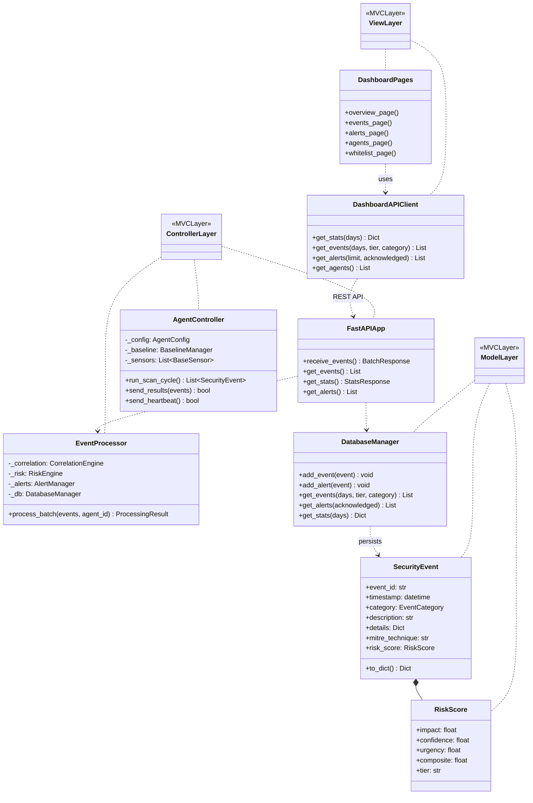
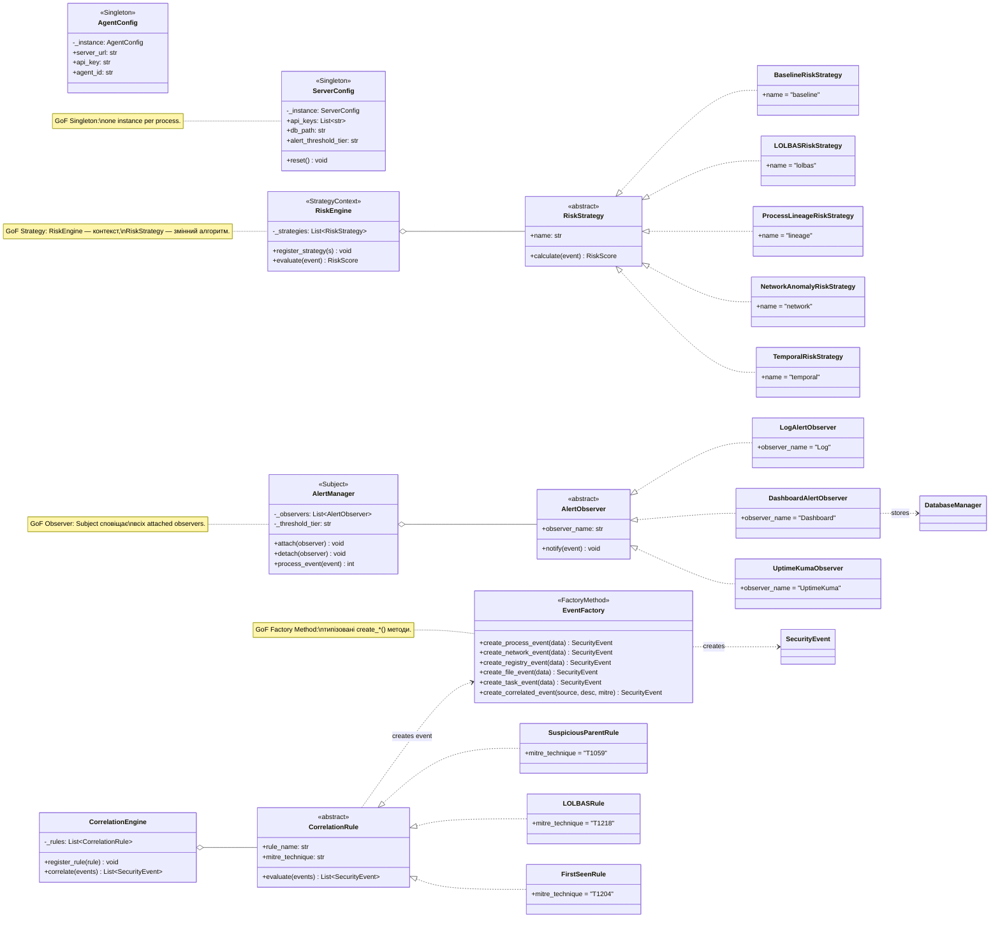

# Рис. 2.1 — MVC-архітектура системи HIDS

```mermaid
classDiagram
direction TB

class ViewLayer { <<MVCLayer>> }
class ControllerLayer { <<MVCLayer>> }
class ModelLayer { <<MVCLayer>> }

class DashboardPages {
    +overview_page()
    +events_page()
    +alerts_page()
    +agents_page()
    +whitelist_page()
}

class DashboardAPIClient {
    +get_stats(days) Dict
    +get_events(days, tier, category) List
    +get_alerts(limit, acknowledged) List
    +get_agents() List
}

class AgentController {
    -_config: AgentConfig
    -_baseline: BaselineManager
    -_sensors: List~BaseSensor~
    +run_scan_cycle() List~SecurityEvent~
    +send_results(events) bool
    +send_heartbeat() bool
}

class FastAPIApp {
    +receive_events() BatchResponse
    +get_events() List
    +get_stats() StatsResponse
    +get_alerts() List
}

class EventProcessor {
    -_correlation: CorrelationEngine
    -_risk: RiskEngine
    -_alerts: AlertManager
    -_db: DatabaseManager
    +process_batch(events, agent_id) ProcessingResult
}

class SecurityEvent {
    +event_id: str
    +timestamp: datetime
    +category: EventCategory
    +description: str
    +details: Dict
    +mitre_technique: str
    +risk_score: RiskScore
    +to_dict() Dict
}

class RiskScore {
    +impact: float
    +confidence: float
    +urgency: float
    +composite: float
    +tier: str
}

class DatabaseManager {
    +add_event(event) void
    +add_alert(event) void
    +get_events(days, tier, category) List
    +get_alerts(acknowledged) List
    +get_stats(days) Dict
}

ViewLayer .. DashboardPages
ViewLayer .. DashboardAPIClient
ControllerLayer .. AgentController
ControllerLayer .. FastAPIApp
ControllerLayer .. EventProcessor
ModelLayer .. SecurityEvent
ModelLayer .. RiskScore
ModelLayer .. DatabaseManager

DashboardPages ..> DashboardAPIClient : uses
DashboardAPIClient ..> FastAPIApp : REST API
FastAPIApp ..> EventProcessor
FastAPIApp ..> DatabaseManager
SecurityEvent *-- RiskScore
DatabaseManager ..> SecurityEvent : persists
```

---

# Рис. 2.2 — Патерни GoF

```mermaid
classDiagram
direction LR

class EventFactory {
    <<FactoryMethod>>
    +create_process_event(data) SecurityEvent
    +create_network_event(data) SecurityEvent
    +create_registry_event(data) SecurityEvent
    +create_file_event(data) SecurityEvent
    +create_task_event(data) SecurityEvent
    +create_correlated_event(source, desc, mitre) SecurityEvent
}

class AgentConfig {
    <<Singleton>>
    -_instance: AgentConfig
    +server_url: str
    +api_key: str
    +agent_id: str
}

class ServerConfig {
    <<Singleton>>
    -_instance: ServerConfig
    +api_keys: List~str~
    +db_path: str
    +alert_threshold_tier: str
    +reset() void
}

class RiskEngine {
    <<StrategyContext>>
    -_strategies: List~RiskStrategy~
    +register_strategy(s) void
    +evaluate(event) RiskScore
}

class RiskStrategy {
    <<abstract>>
    +calculate(event) RiskScore
    +name: str
}

class BaselineRiskStrategy { +name = "baseline" }
class LOLBASRiskStrategy { +name = "lolbas" }
class ProcessLineageRiskStrategy { +name = "lineage" }
class NetworkAnomalyRiskStrategy { +name = "network" }
class TemporalRiskStrategy { +name = "temporal" }

class AlertManager {
    <<Subject>>
    -_observers: List~AlertObserver~
    -_threshold_tier: str
    +attach(observer) void
    +detach(observer) void
    +process_event(event) int
}

class AlertObserver {
    <<abstract>>
    +notify(event) void
    +observer_name: str
}

class LogAlertObserver { +observer_name = "Log" }
class DashboardAlertObserver { +observer_name = "Dashboard" }
class UptimeKumaObserver { +observer_name = "UptimeKuma" }

class CorrelationEngine {
    -_rules: List~CorrelationRule~
    +register_rule(rule) void
    +correlate(events) List~SecurityEvent~
}

class CorrelationRule {
    <<abstract>>
    +evaluate(events) List~SecurityEvent~
    +rule_name: str
    +mitre_technique: str
}

class SuspiciousParentRule { +mitre_technique = "T1059" }
class LOLBASRule { +mitre_technique = "T1218" }
class FirstSeenRule { +mitre_technique = "T1204" }

RiskStrategy <|.. BaselineRiskStrategy
RiskStrategy <|.. LOLBASRiskStrategy
RiskStrategy <|.. ProcessLineageRiskStrategy
RiskStrategy <|.. NetworkAnomalyRiskStrategy
RiskStrategy <|.. TemporalRiskStrategy
RiskEngine o-- RiskStrategy

AlertObserver <|.. LogAlertObserver
AlertObserver <|.. DashboardAlertObserver
AlertObserver <|.. UptimeKumaObserver
AlertManager o-- AlertObserver
DashboardAlertObserver ..> DatabaseManager : stores

CorrelationRule <|.. SuspiciousParentRule
CorrelationRule <|.. LOLBASRule
CorrelationRule <|.. FirstSeenRule
CorrelationEngine o-- CorrelationRule
CorrelationRule ..> EventFactory : creates event

EventFactory ..> SecurityEvent : creates

note for RiskEngine "GoF Strategy: RiskEngine — контекст,\nRiskStrategy — змінний алгоритм."
note for AlertManager "GoF Observer: Subject сповіщає\nвсіх attached observers."
note for EventFactory "GoF Factory Method:\nтипізовані create_*() методи."
note for ServerConfig "GoF Singleton:\none instance per process."
```
